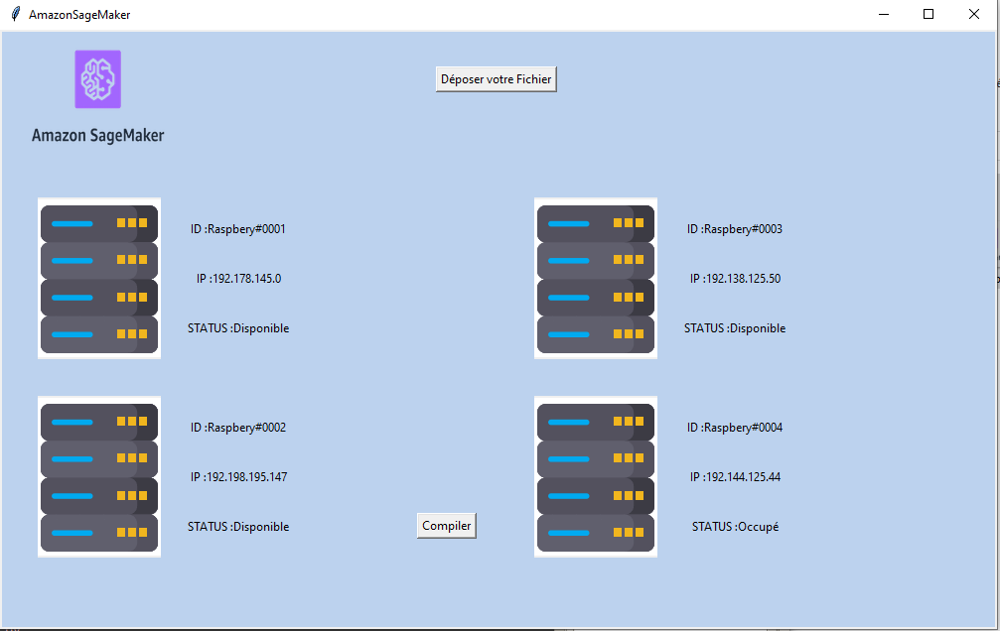
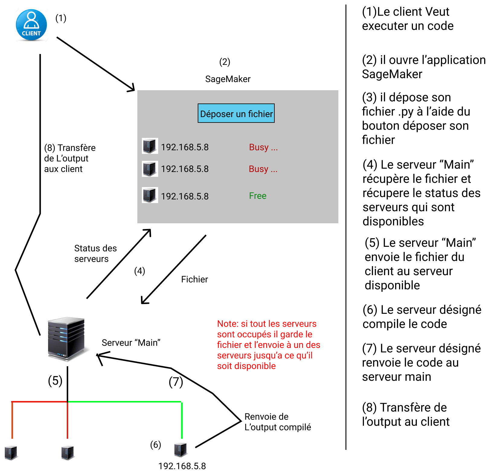
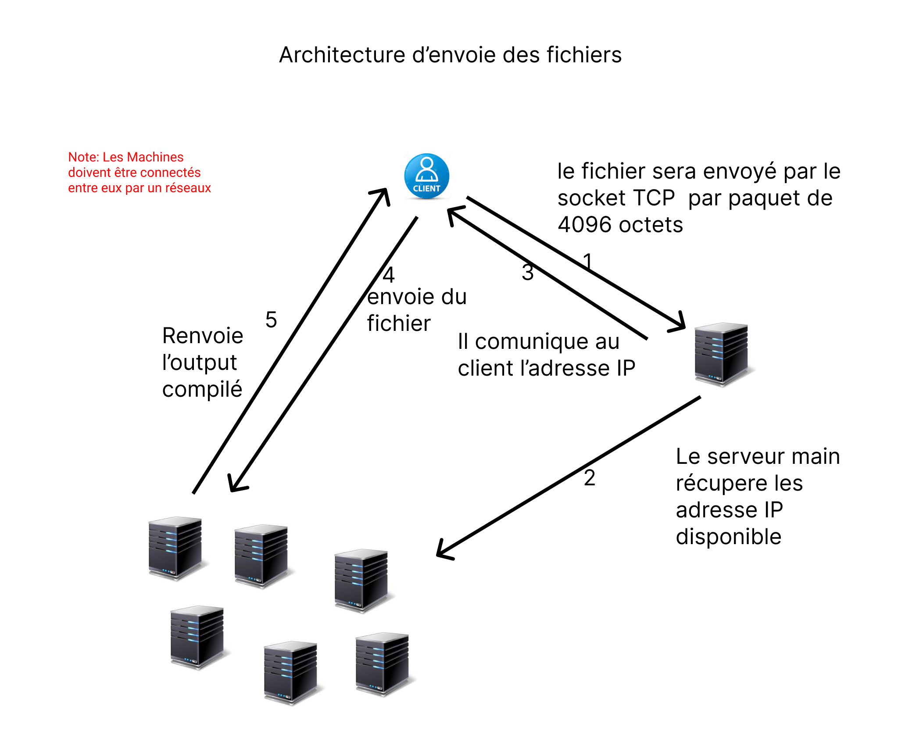

# SykzSageMaker

## Projet Réseaux L3 informatique Paris Saclay

Projet : Développer une application qui permet de compiler des modèles de machine Learning sur des serveurs distant

Notre projet et de reproduire le service d’amazon « AWS Sagemaker » qui consiste à déployer et à entrainer des modèle de ML dans les serveurs raspberry . en cas pratique j’envoie un bout de code à la GUI faite par nous le bout de code sera alors ensuite renvoyé vers le serveur main (qui gère la distribution des tâches)par SSH , le code sera ensuite compiler sur l’un des serveur en fonction de leurs disponibilités , une fois terminé les output (fichiers,txt..) seront communiqué au client directement ,
Le client ne se souciera pas des librairies , veillez à laisser son pc allumer … ,il devra juste assurer que son code fonctionne
.

## Demo Utulisation

## Interface Client



## Conception



## Architecture d'envoie de fichier



## Requirement Client:

-git </br>
-python3 </br>
-pip

## Requirement Serveur:

-git </br>
-python3 </br>
-pip

## Utilisations Client

```
git clone https://github.com/Sykzen/SykzSageMaker.git
cd SykzSageMaker
pip install -r requirements_client.txt
python3 client.py
```

## Utilisations Serveur "main"

```
git clone https://github.com/Sykzen/SykzSageMaker.git
cd SykzSageMaker
pip install -r requirements_server.txt
python3 server.py
```

## Add Server

```
A venir
```

## Contributors

- [Sykzen](https://github.com/Sykzen)

## Source

-https://docs.python.org/3/library/socket.html
