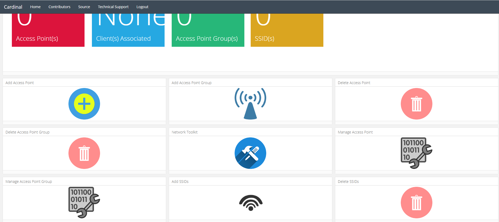
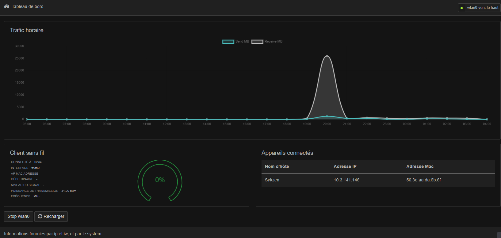

# SykzSageMaker

## Projet Réseaux L3 informatique Paris Saclay

Projet : Développer une application qui permet de compiler des modèles de machine Learning sur des serveurs distant

Notre projet et de reproduire le service d’amazon « AWS Sagemaker » qui consiste à déployer et à entrainer des modèle de ML dans les serveurs raspberry . en cas pratique j’envoie un bout de code à la GUI faite par nous le bout de code sera alors ensuite renvoyé vers le serveur main (qui gère la distribution des tâches)par SSH , le code sera ensuite compiler sur l’un des serveur en fonction de leurs disponibilités , une fois terminé les output (fichiers,txt..) seront communiqué au client directement ,
Le client ne se souciera pas des librairies , veillez à laisser son pc allumer … ,il devra juste assurer que son code fonctionne
.

## Demo Utulisation

https://user-images.githubusercontent.com/55047001/162601596-e7541125-d977-4e4a-82eb-6537fc7df638.mp4

## Interface Client


## Conception


## Architecture d'envoie de fichier


## Interface SysAdmin



## Interface Access Point



## Requirement Client:

-git </br>
-python3 </br>
-pip

## Requirement Serveur:

-git </br>
-python3 </br>
-pip

## Requirement Serveur:

-git </br>
-python3 </br>
-pip

## Access Interface SysAdmin

```
cd admin_sys/cardinal-docker
docker-compose build
docker-compose up
```

Open your browser and go to http://localhost:1000

## Utilisations Client

```
git clone https://github.com/Sykzen/SykzSageMaker.git
cd SykzSageMaker
pip install -r requirements_client.txt
python3 client.py
```

## Utilisations Serveur "main"

```
/usr/bin/python3 buid/build_main.py
git clone https://github.com/Sykzen/SykzSageMaker.git
cd SykzSageMaker
pip install -r requirements_main.txt
python3 main.py
```

Sur le rc.local, il faut ajouter la ligne suivante :

```
/usr/bin/python3 /home/pi/SykzSageMaker/main.py &
```

## Add Server

Connecter sur l'accèss point ssh du serveur main et faire la commande suivante :

```
git clone https://github.com/Sykzen/SykzSageMaker
pip install -r requirements_server.txt
```

Sur le serveur main, il faut ajouter le serveur à la liste des serveurs disponibles
Sur le rc.local, il faut ajouter la ligne suivante (avant exit 0) :

```
/usr/bin/python3 /home/pi/SykzSageMaker/Server.py &
```

## Make AD-hoc dhcp

```
/bin/sh build/build_adhoc.sh
```

## Contributors

- [Sykzen](https://github.com/Sykzen)

## Source

-https://docs.python.org/3/library/socket.html -https://raspberry-pi.fr/executer-programme-demarrage/ -https://sites.google.com/site/blainoperso/debuter-avec-raspberry-pi/14---creer-une-reseau-ad-hoc -https://github.com/simondlevy/RPiAdHocWiFi

- https://github.com/cardinal-dev/cardinal-docker
- https://fr.wikipedia.org/wiki/Received_Signal_Strength_Indication#:~:text=En%20t%C3%A9l%C3%A9communications%2C%20le%20Received%20Signal,l'intensit%C3%A9%20du%20signal%20re%C3%A7u.
